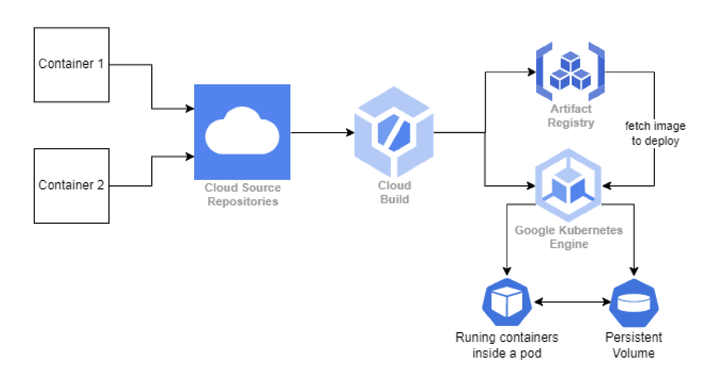

# GCP Kubernetes Microservices Project

## DEMO VIDEO:
[Watch the Kubernetes Microservices app Demo](https://drive.google.com/file/d/1vrp1W9X-SLxlGjZqsnv22eWPS8admHZu/view?usp=sharing)

## Overview

This project is a microservices architecture deployed on Google Kubernetes Engine (GKE). It consists of two containers, Container 1 and Container 2, which communicate bidirectionally to perform file storage, retrieval, and product calculation tasks. The infrastructure is provisioned using Terraform, and CI/CD pipelines are set up using GCP Cloud Source Repository and Cloud Build.

## Architecture Diagram




## Container 1

Container 1 serves as the gateway for storing files to a persistent volume in GKE and calculating products from the stored files. It exposes REST API endpoints for file storage and product calculation. 

### Features

- **Store File Endpoint**: Accepts JSON input to create and store files in GKE persistent storage.
- **Calculate Product Endpoint**: Accepts JSON input to calculate the total of a product from the stored file.

### JSON Input:

```json
{
  "file": "file.dat",
  "data": "product, amount \nwheat, 10\nwheat, 20\noats, 5"
}

```

### JSON Output:

```json
{
  "file": "file.dat",
  "message": "Success."
}

```

### Example file.dat:

product, amount
wheat,10
wheat,20
oats,5

## Container 2

Container 2 listens on a specified port and endpoint to interact with Container 1. Its primary role is to calculate the total of a product by summing rows of the same product from the given file.

### Features

- **Product Calculation**: Calculates the total of a product from the given file.

## Additional Requirements

- **CI/CD Pipeline**: Utilizes GCP Cloud Source Repository and Cloud Build for automated building and deployment of code changes.
- **Terraform Script**: Infrastructure provisioning is automated using Terraform scripts.
- **Cluster Configuration**: Configures the GKE cluster according to specified requirements to minimize costs.
- **Persistent Volume**: Attaches a persistent volume to the GKE cluster for file storage.
- **Service Exposure**: Exposes Container 1 service to the internet for external access.

## How to Use

1. Clone the repository.
2. Navigate to the `kubernetes-service<ServiceNumber>` folder.
3. Deploy the pvc.yaml file for mounting the persisting volume claim of 1Gi.
4. Deploy the Kubernetes workload using the provided YAML file.
4. Access the REST API endpoints of Container 1 for file storage and product calculation.
